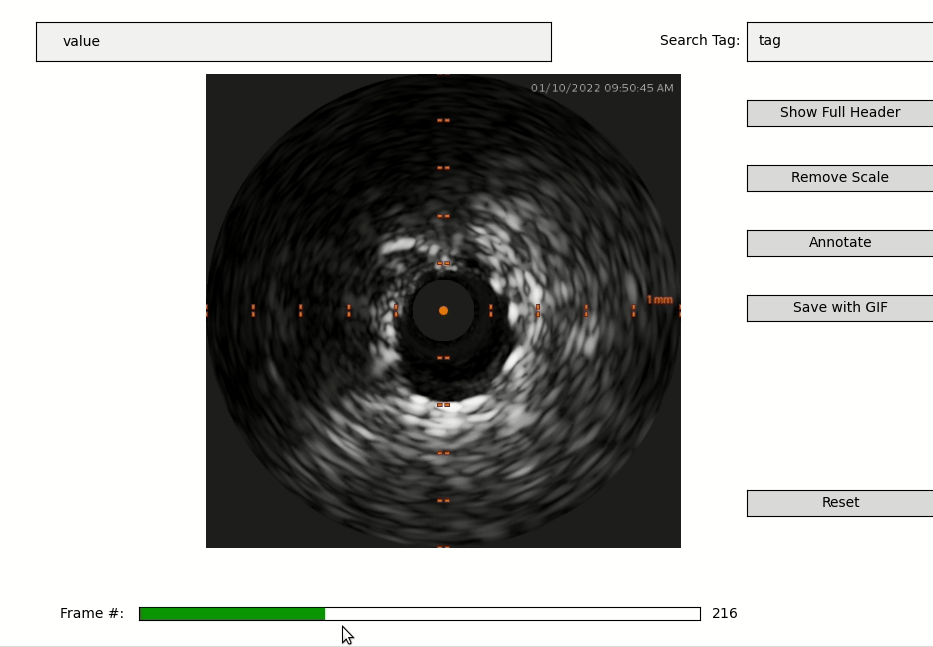
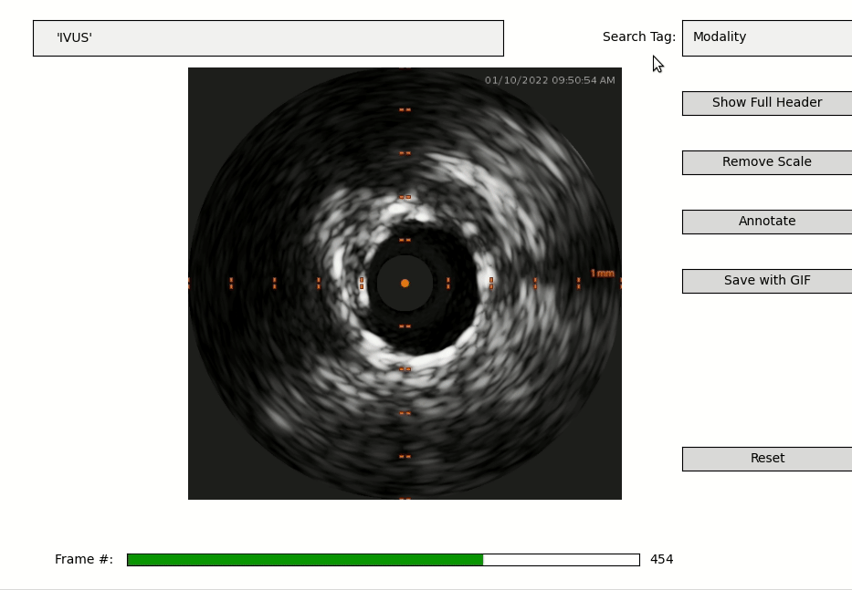
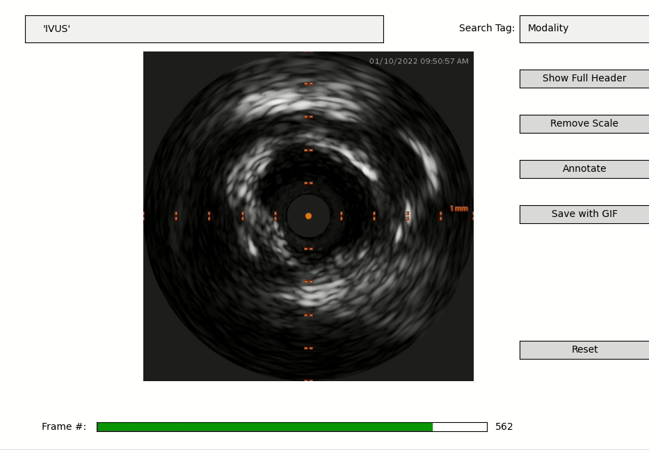
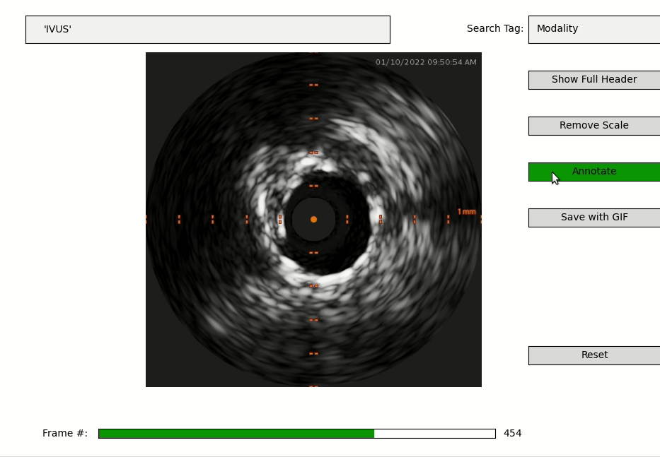

# Simple IVUS-pullback Viewer

Open source DICOM viewers (e.g., [OHIF](https://ohif.org/)) do not work well for 
IVUS pullback data (or other types of Multi-frame Objects, e.g. from mammography). 
All frames are stored in a single series instance, and often the individual frames 
are not true RGB images. The base data are stored as 8/16-bit grayscale, but the images are 
represented as 3D-array solely because of scale-mark annotations that are added 
by the imaging device.

This script is a simple viewer largely based on just matplotlib package. It allows 
frame-scrolling, viewing, simple tag-description searches in header, some 
processing to remove scale-marks, and apply basic annotations.

## Run

After cloning the repo, if necessary, create a conda environment with python>=3.8 and install
virtualenv
```bash
conda create --name viewer python=3.9
conda activate viewer
pip install virtualenv
```

create a virtual environment inside and install the dependencies:
```bash
python -m virtualenv venv
source venv/bin/activate
pip install -r requirements.txt
```

Note that on Windows the environment activation goes something like:
```bash
.\venv\Scripts\activate
```
and to run:
```bash
python viewer.py path/to/pullback/series
```

## Usage

### 1. Frame-scrolling

Individual frames can be scrolled through matplotlib's slider widget:



### 2. Header viewer/search

Individual tags can be searched by value on `Search Tag` box, or the 
entire header is opened as a textfile when `Show Full Header` is clicked:



### 3. Frame cleaning

All device generated scale marks are removed when `Remove Scale` is clicked. 
Note that the processed image is still 3D, but with identical 3rd axis values.



### 4. Basic annotations

Annotations are generated by collecting mouse-clicked points, which are then 
fed into an algorithm that performs linear periodic interpolation on polar 
coordinates:

